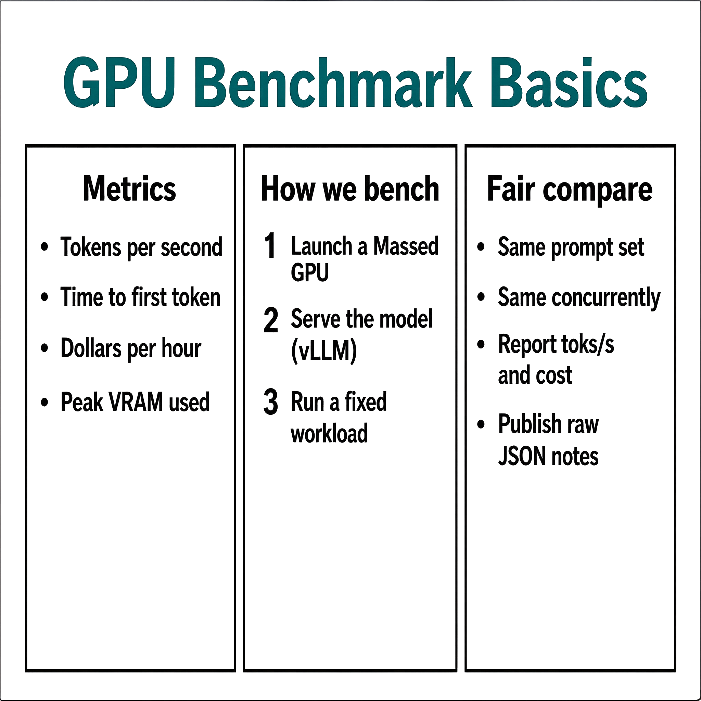

# SenseNova-U1 Infographic V3 GPU Benchmark

### Last Edit Date:
MC - 2026.07.20

## Purpose
Live Massed Compute text-to-image benches for **sensenova/SenseNova-U1-8B-MoT-Infographic-V3** (any-to-any / infographic T2I, Apache-2.0).

## Technique
Official SenseNova-U1 `examples/t2i/inference.py`, BF16, `device_map=auto`, **20 steps**, CFG 4.0, trained bucket **2048×2048**. Headline metric: **avg generation latency** from `--profile` (excludes cold model reload).

## Results

| SKU | $/hr | Res | Gen latency mean (s) | Images/s | Peak VRAM (GB) |
|---|---:|---|---:|---:|---:|
| `gpu_1x_pro_6000_blackwell` | 2.19 | 2048x2048 | 11.832 | 0.0845 | 34.8 |
| `gpu_1x_h100` | 2.73 | 2048x2048 | 13.435 | 0.0744 | 34.8 |

### Screenshots

**gpu_1x_pro_6000_blackwell** — $2.19/hr

**gpu_1x_h100** — $2.73/hr

## Conclusion

Blackwell leads both raw latency and $/hr at 2048² / 20 steps in this capture (~12% faster gen than H100).

## Notes
- Open-weight SenseNova-U1 Infographic V3 (Apache-2.0); code from OpenSenseNova/SenseNova-U1.
- Numbers from live Massed runs 2026-07-20; bench VMs terminated after capture.

---

  

  <strong><a href="https://massedcompute.com/?utm_source=github.com&utm_campaign=gpu-benchmark">LAUNCH GPU OR CPU INSTANCE</a></strong>

> **Pricing note:** Listed `$/hr` rates are point-in-time from the capture date. Confirm live pricing in the marketplace before you launch — rates can change. Pay only for the hours you use; no long-term contracts.
