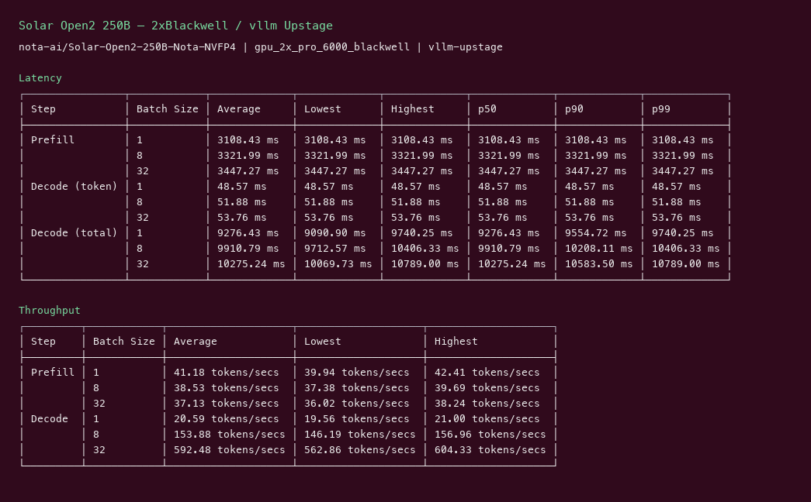

# Solar Open2 250B-A15B GPU Benchmark

### Last Edit Date:
MC - 2026.07.22

## Purpose
Live Massed Compute inference benches for **nota-ai/Solar-Open2-250B-Nota-NVFP4** (NVFP4 of upstage/Solar-Open2-250B).

## Technique
Upstage `vllm-solar-open2` Docker (v0.22.0). `--tensor-parallel-size 2 --moe-backend cutlass --max-model-len 4096 --enforce-eager --disable-custom-all-reduce`. Concurrent chat completions (max_tokens=128); headline = aggregate output tok/s at concurrency 32.

## Results

| Engine | SKU | $/hr | Output tok/s (c32) | TTFT med (ms) | tok/s per $ |
|---|---|---:|---:|---:|---:|
| vllm-upstage | `gpu_2x_pro_6000_blackwell` | 4.38 | 592.5 | 3447.3 | 135.3 |

### Screenshots

Terminal-style serving-bench captures, Massed Compute 2026-07-22.

**gpu_2x_pro_6000_blackwell** — 2x RTX PRO 6000 Blackwell 96GB — $4.38/hr

vLLM Upstage · NVFP4 · c32 **592.5** output tok/s · TTFT med **3447.3** ms:

## Conclusion

Peak c32 output throughput: **592 tok/s** on `gpu_2x_pro_6000_blackwell` with **vllm-upstage**.
Best $/tok: **135.3 tok/s per $** on `gpu_2x_pro_6000_blackwell`.

## Notes
- Stock vLLM rejects `SolarOpen2ForCausalLM`; used Upstage fork image `upstage/vllm-solar-open2`.
- NVFP4 requires `--moe-backend cutlass` (not `triton`). Expert-parallel + cutlass failed on this SKU; TP=2 without EP succeeded.
- BF16 full weights need ~8×80GB; NVFP4 fits 2×96GB.
- Second multi-GPU SKU (`gpu_2x_h200_nvl` / `gpu_2x_h100_nvl`) unavailable or undersized disk during this wave.
- Numbers from live Massed runs 2026-07-22; disposable bench VMs terminated after capture.

---

**[LAUNCH GPU OR CPU INSTANCE](https://massedcompute.com/?utm_source=github.com&utm_campaign=gpu-benchmark)**

> **Pricing note:** Listed `$/hr` rates are point-in-time from the capture date. Confirm live pricing in the marketplace before you launch — rates can change. Pay only for the hours you use.
