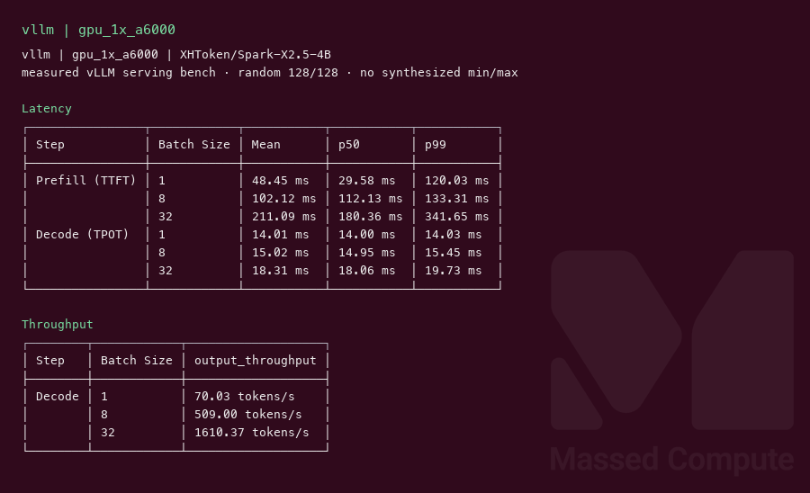
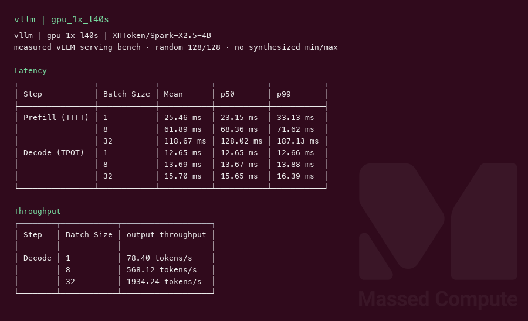
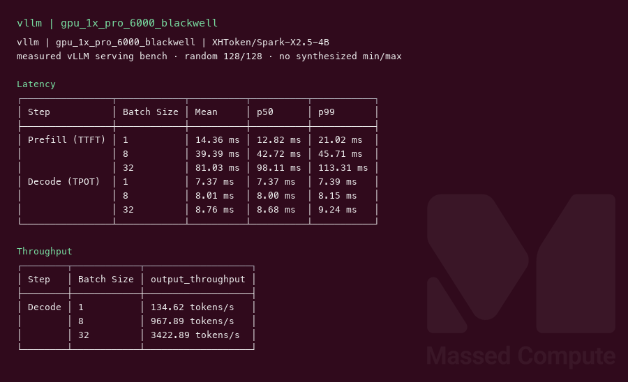

# Spark-X2.5-4B GPU Benchmark

### Last Edit Date:
MC - 2026.09.08

## Purpose
Live Massed Compute vLLM benches for **XHToken/Spark-X2.5-4B** (4.1B Apache 2.0, hybrid SWA + full attention). Exact BF16 weights on every SKU. Decode profile only — native 1M context was **not** benched.

## Technique
Pinned profile: random prompts, input=128, output=128, request-rate=inf, concurrency 1 / 8 / 32. Headlines use **c32**.
Engine: **vLLM** `vllm/vllm-openai:latest` (v0.28.0) + [`vllm-spark2-5-plugin`](https://pypi.org/project/vllm-spark2-5-plugin/) (`VLLM_PLUGINS=spark2_5`), `--trust-remote-code --max-model-len 8192 --gpu-memory-utilization 0.90 --enable-prefix-caching --tool-call-parser spark25 --reasoning-parser qwen3`.

Stock `vllm-openai:latest` without the plugin cannot load `Spark2_5ForCausalLM`.

## Results

| Engine | SKU | Weights | $/hr | Output tok/s (c32) | TTFT med (ms) | tok/s per $ | $/1M out tokens |
|---|---|---|---:|---:|---:|---:|---:|
| vllm | `gpu_1x_a6000` | BF16 | 0.57 | 1610.4 | 180.4 | 2825.2 | 0.098 |
| vllm | `gpu_1x_l40s` | BF16 | 0.97 | 1934.2 | 128.0 | 1994.1 | 0.139 |
| vllm | `gpu_1x_pro_6000_blackwell` | BF16 | 2.19 | 3422.9 | 98.1 | 1563.0 | 0.178 |

### Screenshots

**gpu_1x_a6000** — $0.57/hr — exact BF16

vllm — 1610.4 output tok/s @ c32:

**gpu_1x_l40s** — $0.97/hr — exact BF16

vllm — 1934.2 output tok/s @ c32:

**gpu_1x_pro_6000_blackwell** — $2.19/hr — exact BF16

vllm — 3422.9 output tok/s @ c32:

## Conclusion

Smallest fit is **`gpu_1x_a6000`** at **2825** tok/s per $ (**1610** tok/s at $0.57/hr). L40S is **20%** faster and **70%** more per hour, so A6000 still wins cost. Blackwell is the throughput card: **3423** tok/s, **2.1×** A6000, **1.8×** L40S, worst tok/s per $ of the three.

Buy A6000 for packed serving and for a chat box billed by the hour. Use Blackwell when 32-way TTFT matters (c32 p99 113 ms vs A6000 342 ms) or a single-user tail (c1 p99 21 ms vs A6000 120 ms). Do not treat the c32 medians (98 ms vs 180 ms) as interactive latency.

## Notes
- 4.1B BF16 (~8.3 GB weights) fits 48 GB; A6000 at $0.57 is the least expensive live SKU that ran it. Multi-GPU is not warranted.
- Same checkpoint on all three rows. Did not bench the advertised 1M context window.
- Serving used `vllm-spark2-5-plugin` inside `vllm/vllm-openai:latest`. First stock-latest start failed with `Spark2_5ForCausalLM` unsupported.
- nvidia-smi at serve-ready: A6000 44420/49140 MiB, L40S 41815/46068 MiB, Blackwell 89971/97887 MiB.
- Showcase tables are measured vLLM serving-bench fields only (TTFT mean/p50/p99, TPOT mean/p50/p99, output_throughput). No synthesized min/max or p90.
- SGLang not captured this wave.
- Numbers from live Massed runs 2026-09-08; bench VMs terminated after capture.
- Raw: `results/raw/spark-x2.5-4b/`.

---

  

  <strong><a href="https://massedcompute.com/?utm_source=github.com&utm_campaign=gpu-benchmark">LAUNCH GPU OR CPU INSTANCE</a></strong>

> **Pricing note:** Listed `$/hr` rates are point-in-time from the capture date. Confirm live pricing in the marketplace before you launch — rates can change. Pay only for the hours you use.
