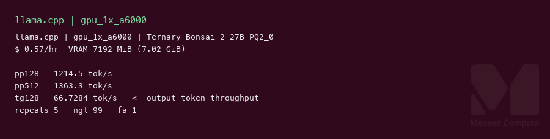
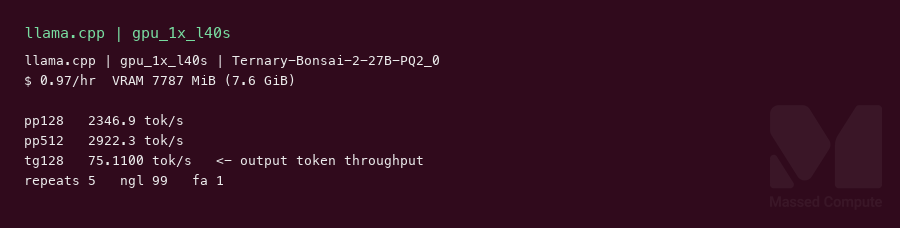
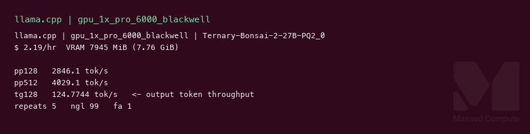

# Ternary Bonsai 2 27B GGUF GPU Benchmark

### Last Edit Date:
MC - 2026.09.21

## Purpose
Live Massed Compute llama.cpp benches for **prism-ml/Ternary-Bonsai-2-27B-gguf** `Ternary-Bonsai-2-27B-PQ2_0.gguf` (Qwen3.8 27B ternary hybrid-attention, ~7.21 GB, Apache-2.0). Stock llama.cpp cannot load these files (`PQ2_0`); this run uses the PrismML fork.

## Technique
`llama-bench` CUDA, `-ngl 99 -fa 1`, profile **pp128 / pp512 / tg128**, 5 repeats. Headline decode = **tg128** (output token throughput). Prefill listed separately. Runner: `scripts/ternary-bonsai-2/remote.sh`.

Engine pin: PrismML-Eng/llama.cpp `9a9394a895b96003ca842a6041cb28ac49a108f7` built in `nvidia/cuda:12.8.0-devel-ubuntu24.04` digest `sha256:9a8fffc32a955361aa66d754e7a0cda2513052eaf5aaf8f3ba69b80578d1c6a9`.

## Results

| Engine | SKU | $/hr | Prefill tok/s (pp128) | Prefill tok/s (pp512) | Output tok/s (tg128) | tok/s per $ (decode) | VRAM (GiB) |
|---|---|---:|---:|---:|---:|---:|---:|
| llama.cpp | `gpu_1x_a6000` | 0.57 | 1214.5 | 1363.3 | 66.7 | 117.1 | 7.02 |
| llama.cpp | `gpu_1x_l40s` | 0.97 | 2346.9 | 2922.3 | 75.1 | 77.4 | 7.60 |
| llama.cpp | `gpu_1x_pro_6000_blackwell` | 2.19 | 2846.1 | 4029.1 | 124.8 | 57.0 | 7.76 |

VRAM = live `nvidia-smi` memory.used MiB / 1024. A6000 VRAM is from a same-binary follow-up `llama-bench` load (the 5-repeat sampler window ended during CUDA compile); tok/s rows are the 5-repeat JSON.

### Screenshots

Terminal-style captures from live `llama-bench` (pp128 / pp512 / tg128, ngl=99, fa=1, 5 repeats) on Massed Compute, 2026-09-21.

**gpu_1x_a6000** — RTX A6000 48GB — $0.57/hr

llama.cpp CUDA · `Ternary-Bonsai-2-27B-PQ2_0.gguf` · output token throughput **66.7 tok/s**:

**gpu_1x_l40s** — L40S 48GB — $0.97/hr

llama.cpp CUDA · same GGUF · output token throughput **75.1 tok/s**:

**gpu_1x_pro_6000_blackwell** — RTX PRO 6000 Blackwell 96GB — $2.19/hr

llama.cpp CUDA · same GGUF · output token throughput **124.8 tok/s**:

## Conclusion

Smallest launched fit is **`gpu_1x_a6000`** at **117.1 tok/s per $** (**66.7** output tok/s at $0.57/hr). Highest output token throughput is **124.8 tok/s** on `gpu_1x_pro_6000_blackwell` (~1.8× A6000 decode, worst tok/s per $ of the three). L40S is the middle card: **75.1 tok/s** at $0.97/hr.

L40S listed at **$0.97/hr** (rate moved from $0.88 on 2026-09-08).

## Notes
- Exact published weights: `Ternary-Bonsai-2-27B-PQ2_0.gguf` (~7.21 GB, 2.13 bpw). `PTQ1_0` and F16 packs in the same repo were not run.
- Untested cheaper live SKUs that should fit this GGUF: `gpu_1x_a6000_low_ram` ($0.55). Out of stock at capture: `gpu_1x_A30` ($0.35), `gpu_1x_a5000` ($0.44). Untested mid-ladder: `gpu_1x_6000_ada` ($0.79), `gpu_1x_l40` ($0.86), `gpu_1x_pro_4500_blackwell` ($0.92).
- Architecture reported as `qwen35 27B PQ2_0`. Flash attention on (`-fa 1`).
- Raw: `results/raw/ternary-bonsai-2-27b-gguf/<sku>/` (`llama-bench.json`, live `nvidia-smi.txt`, `DONE`).
- Bench VMs terminated after capture.

---

  

  <strong><a href="https://massedcompute.com/?utm_source=github.com&utm_campaign=gpu-benchmark">LAUNCH GPU OR CPU INSTANCE</a></strong>

> **Pricing note:** Listed `$/hr` rates are point-in-time from the capture date. Confirm live pricing in the marketplace before you launch — rates can change. Pay only for the hours you use.
