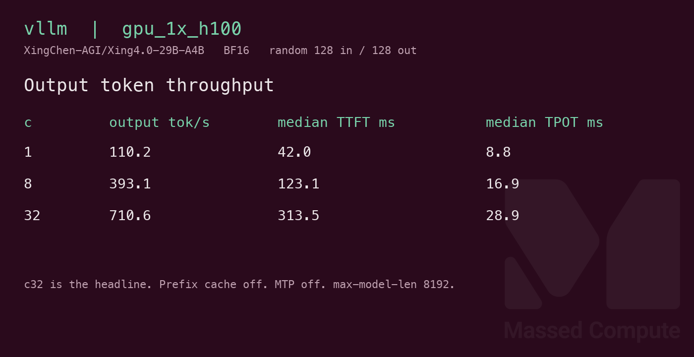
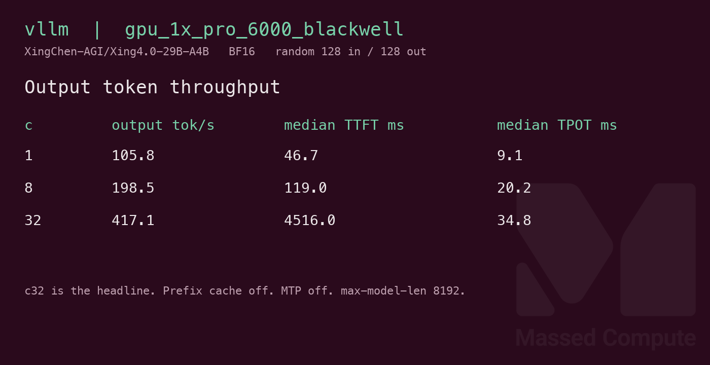

# Xing4.0-29B-A4B GPU Benchmark

### Last Edit Date:
MC - 2026.09.29

## Purpose
Live Massed Compute vLLM benches for [XingChen-AGI/Xing4.0-29B-A4B](https://huggingface.co/XingChen-AGI/Xing4.0-29B-A4B) (BF16, Apache 2.0). 31.2B total parameters, about 4B active, 64 routed experts, top-4. Exact BF16 safetensors.

## Technique
Pinned profile: random prompts, input=128, output=128, request-rate=inf, concurrency 1 / 8 / 32. Headlines use **c32** **Output token throughput**.
Upstream vLLM has no `Xing4_0` architecture. Engine is the vendor image `quay.io/xingchen-agi/xingchen-inference-vllm:v0.29.1rc1-xing4_0` digest `sha256:05a2d31748cdcda8002f21ffc93183e880adea41b14e3ecc5917b348570ffc6b` (`vllm 0.29.1rc1.dev187+gaf1c01499`). Same flags on every SKU: `--tensor-parallel-size 1 --max-model-len 8192 --gpu-memory-utilization 0.92 --max-num-batched-tokens 16384 --max-num-seqs 64 --trust-remote-code`. Prefix cache off. MTP off. Runner: `scripts/xing4-29b-a4b/remote_vllm.sh`.

## Results

| Engine | SKU | Weights | $/hr | Output tok/s (c32) | TTFT med (ms) | tok/s per $ | $/1M out tokens |
|---|---|---|---:|---:|---:|---:|---:|
| vllm | `gpu_1x_a100` | BF16 | 1.35 | 833.3 | 399.5 | 617.2 | 0.450 |
| vllm | `gpu_1x_h100` | BF16 | 2.73 | 710.6 | 313.5 | 260.3 | 1.067 |
| vllm | `gpu_1x_pro_6000_blackwell` | BF16 | 2.19 | 417.1 | 4516.0 | 190.5 | 1.458 |

`$/hr` is the live list rate on 2026-09-29.

### Screenshots

Serving-bench cards from the raw JSON (input=128, output=128, concurrency 1/8/32).

**gpu_1x_a100** — A100 80GB — $1.35/hr

vLLM · `XingChen-AGI/Xing4.0-29B-A4B` · c32 **833.3** output tok/s · TTFT med **399.5** ms:

**gpu_1x_h100** — H100 80GB — $2.73/hr

vLLM · `XingChen-AGI/Xing4.0-29B-A4B` · c32 **710.6** output tok/s · TTFT med **313.5** ms:

**gpu_1x_pro_6000_blackwell** — RTX PRO 6000 Blackwell 96GB — $2.19/hr

vLLM · `XingChen-AGI/Xing4.0-29B-A4B` · c32 **417.1** output tok/s · TTFT med **4516.0** ms:

## Conclusion

Smallest single GPU that can hold the BF16 pack is **`gpu_1x_a100`** at **$1.35/hr**, and it is also the c32 winner in the table: **833.3** output tok/s, **617.2** tok/s per $. H100 is faster at concurrency 1 (**110.2** vs A100 **88.6** output tok/s) and has the lowest table c32 TTFT (**313.5** ms), then falls behind at c32 (**710.6** tok/s) at **$2.73/hr**. Blackwell leads concurrency 1 against the A100 (**105.8** tok/s). Its table c32 is **417.1** tok/s with a **4516.0** ms median TTFT. A same-day repeat on a new VM did not reproduce that stall (see below).

## Notes
- BF16 weights are **31,215,028,352** parameters, about **58.1 GiB**. A 48GB card cannot hold that pack. `gpu_1x_a6000`, `gpu_1x_l40s`, and `gpu_1x_l40` were not launched.
- `gpu_1x_a100` at **$1.35** is the least expensive single 80GB listing with capacity. `gpu_1x_A100_SXM4` and `gpu_1x_DGX_A100` were **$1.38** and were not launched for this profile.
- The vendor sample command uses tensor parallel 2, a 256K context, and MTP. The table is one GPU, context 8192, MTP off, so the tok/s is plain decode.
- Blackwell c8 median TTFT in the table capture is **119.0** ms; the c32 median **4516.0** ms is that same successful run (160 completed, 0 failed), with the server resident.

### Same-day checks

These are separate profiles from the table. Same image, context 8192, prefix cache off, random 128/128. They do not replace the table rows.

`gpu_2x_a6000` at **$1.14/hr**, tensor parallel 2, MTP off. c32 output tok/s **627.8**, TTFT med **867.6** ms, **550.7** tok/s per $, **$0.504** per 1M output tokens. 160 completed, 0 failed. Slower per token than the A100 row.

Repeat of the table profile on new VMs. First number is the c32 after c1 and c8. Second number is another c32 on that same server.

| SKU | c32 output tok/s | warm c32 output tok/s | c32 TTFT med (ms) | warm TTFT med (ms) |
|---|---:|---:|---:|---:|
| `gpu_1x_a100` | 833.5 | 851.9 | 427.7 | 278.0 |
| `gpu_1x_h100` | 671.7 | 1073.9 | 306.6 | 231.8 |
| `gpu_1x_pro_6000_blackwell` | 745.0 | 746.4 | 224.2 | 134.0 |

Each of those six runs completed 160 prompts and failed 0. The Blackwell stall in the table did not show up on this repeat.

MTP on, one speculative token, same 8192 context, new process after the repeat. Speculative acceptance on the c32 run was **8.59%** (A100), **5.46%** (H100), and **8.07%** (Blackwell). c32 output tok/s: A100 **391.4**, H100 **428.0**, Blackwell **351.5**. Slower than the MTP-off repeat above. Random 128-token prompts are a poor match for this draft head.
- `nvidia-smi` memory.used while the server was at full utilization, divided by 1024: A100 **71.70 GiB**, H100 **71.47 GiB**, Blackwell **86.38 GiB**.
- Numbers from live Massed runs 2026-09-29.

---

  

  <strong><a href="https://massedcompute.com/?utm_source=github.com&utm_campaign=gpu-benchmark">LAUNCH GPU OR CPU INSTANCE</a></strong>

> **Pricing note:** Listed `$/hr` rates are point-in-time from the capture date. Confirm live pricing in the marketplace before you launch — rates can change. Pay only for the hours you use.
